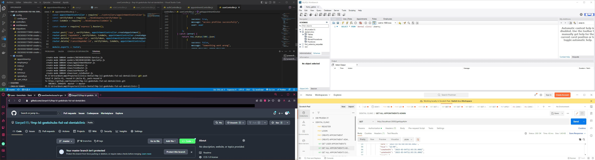
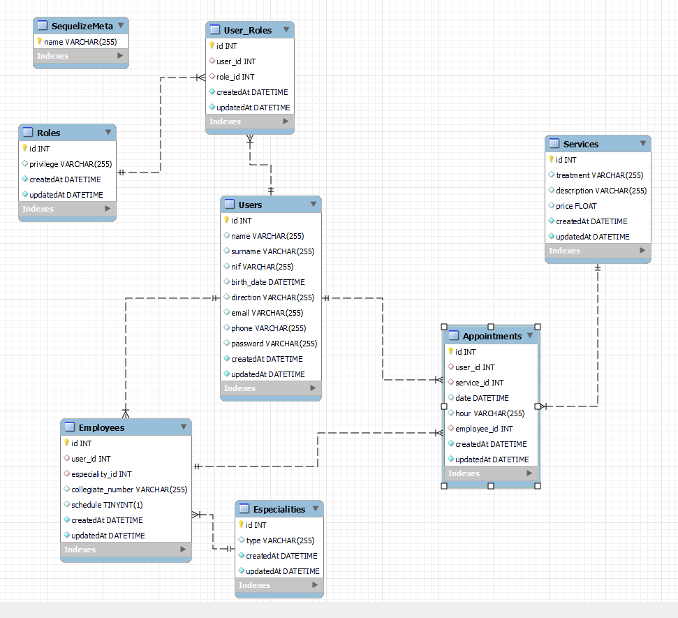
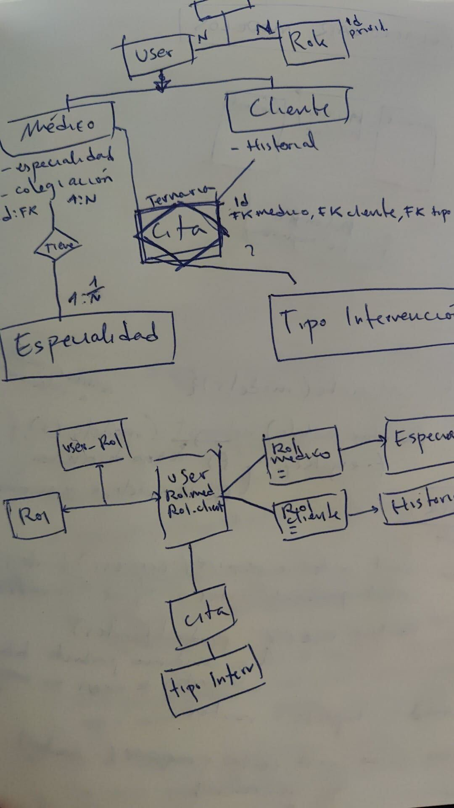
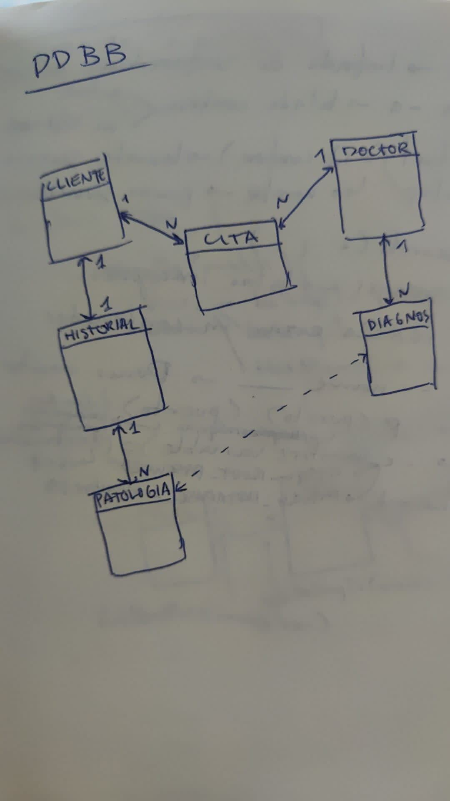
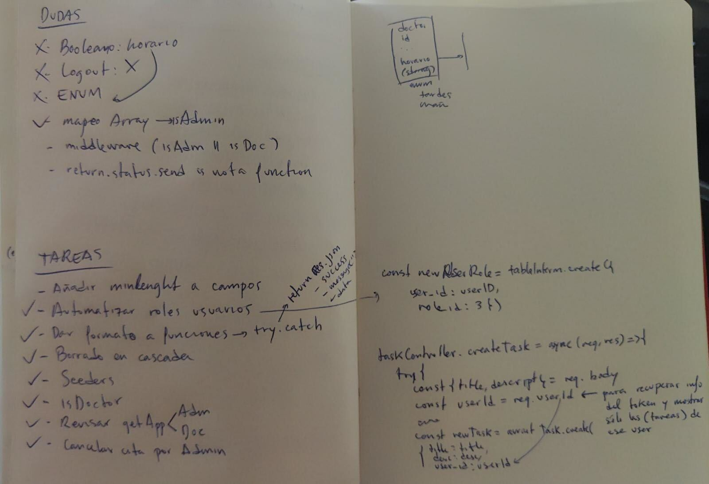
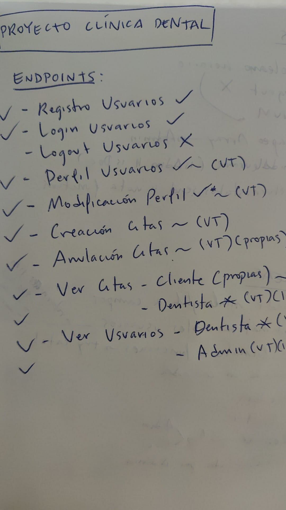

# Welcome to dental clinic backend app
<p align="center"></p> 

<details>
  <summary>Index</summary>
  <ol>
    <li><a href="#about-this-project">About this project</a></li>
    <li><a href="#deploy">Deploy</a></li>
    <li><a href="#stack">Stack</a></li>
    <li><a href="#diagram-bd">Diagram DB</a></li>
    <li><a href="#local-instalation">Local installation</a></li>
    <li><a href="#how-do-we-do-it">How do we do it</a></li>
    <li><a href="#project-structure">Project structure</a></li>
    <li><a href="#data-base">Database</a></li>
    <li><a href="#endpoints">Endpoints</a></li>
    <li><a href="#known-bugs">Known bugs</a></li>
    <li><a href="#future-functionalities">Future funtionalities</a></li>
    <li><a href="#licence">Licence</a></li>
    <li><a href="#webgraphy">Webgraphy</a></li>
    <li><a href="#gratitudes">Gratitudes</a></li>
    <li><a href="#contact">Contact</a></li>
  </ol>
</details>

## About this project
<p align="center">The product department GeeksHubs request us to create the backend corresponding to the appointment management system for a Dental Clinic.
A database and a REST API will be created.
The patient must be able to register in the application, login and access to their client area. In your patient area you should be able to see a list of appointments that has to, in the future, create appointments, modify them and cancel them.
There will also be a user area with your personal data, which can only be seen by himself.
In addition, dentists must be able to register as professionals, make login and view all appointments with registered customers.</p>
  

## Stack
<p>Technologies that has been used:</p>
<div align="center">
    <a href="https://expressjs.com/">
        
    </a>
    <a href="https://nextjs.org/">
        
    </a>
    <a href="https://developer.mozilla.org/es/docs/Web/JavaScript">
        
    </a>
    <a href="https://jwt.io/">
        
    </a>
    <a href="https://www.postman.com/">
        
    </a>
    <a href="https://www.mysql.com/">
        
    </a>
    <a href="https://www.github.com/">
        
    </a>
    <a href="https://git-scm.com/">
        
    </a>
    <a href="https://www.docker.com/">
        
    </a>
    <a href="https://www.sequelize.org/">
        
    </a>
</div>

## Diagram DB



## Local installation

Steps to make it work on your local computer:
1. Clone the project on your computer with git bash:
 `$git clone 'url-repository'`
2. Install all dependencies with the following command:
 ` $ npm i `
3. Create a .env file following the template .env.example provided and type all credentials. If you cannot get them, change the parameters for your own local database set up running in docker.
4.  Start the server with:
 ``` $ npm run dev ```
5. Connect the repository with the database with the following commands:
 ``` $ npx sequelize-cli db:create ``` 
 ``` $ npx sequelize-cli db:migrate ``` 
 ``` $ npx sequelize-cli db:seed:all ```

6. Import this file in postman to get the endpoints we have created:
[](https://app.getpostman.com/run-collection/26229497-73bc7768-cb38-47f0-8784-b78a3e18a39a?action=collection%2Ffork&collection-url=entityId%3D26229497-73bc7768-cb38-47f0-8784-b78a3e18a39a%26entityType%3Dcollection%26workspaceId%3Da4a7fa1f-bae1-41b0-8f54-556776de2238)


## How do we do it
For the app of the dental clinic we have implemented different technologies already mentioned above in "Stack" such as JavaScript, NodeJS, MySQL, etc.
Firstable we desing our database and all relationships, in which there were a couple of modifications to simplify it as much as possible, you can see some of the sketches used:

 ||
|-|-|-|

After this we organized ourselves in terms of requirements that we wanted to have in our app and marked all the final points of the project as seen in the following photos:

| ||
|-|-|-|
During the process we had few issues, which we could mention the two most important. One was deletion of a user in cascade which generated issues deleting data from related tables, and the second one get all information through intermediate tables with map.

## Project structure
We used model view controller to structure our project. We created a basic CRUD.
The project will have the following structure:
-	Index.js: This is the main file. From this file we call to routes file, express and middleware that will have all the routes called and the server is started.
-	Config.
      - Config.json: This file manages the configuration to connect to the database. It is created automatically with sequelize.
-	Middlewares: This file manages common services, such as authentication through use of tokens to access API restricted zones.
      - Is admin
      - Is doctor
      - Verify token
-	db.js: Shows the configuration that must have into .env file that must be created for the application to work.
    ```PORT = PORT```
    ```JWT_SECRET = SECRET```

-	Router.js: This file manages the different paths that the application can have. A route will be created for each table in the database that we want to access, in addition to routing the authenticators.
-	Views:
      - appointmentRoutes.js: In this file we manage the path /appointments and the endpoints that point to that route.
      - AuthRoutes.js: In this file we manage the /auth path and the endpoints pointing to that path.
      - roleRoutes.js: In this file we manage the path /roles and the endpoints pointing to that path.
      - User_roleRoutes.js: In this file we manage the path /users-roles and the endpoints that point to that route.
      - usersRoutes.js: In this file we manage the /users path and the endpoints that point to that path.
      
-	Controllers: There are controllers for each of the established routes. The services that answer for them are entered into the controllers themselves through the routes.
-	.env.example: This file manages environment variables.


## DataBase

This project required a functional API connected to a database with different relationships.
The database has 7 models: role, user_role, user, service, appointment, employee and specialty.
Our database is based on two types of relationships.
From many to many (N:N), in our case many users can have many services and this is controlled through the intermediate appointment model.
We can also observe that we have more N:N relationships like users and roles, in which user can have different roles and a role can be had by many users or even between the models user and appointment.
The last relation that remains for us to mention is one to many (1:N), in our case it is between employees and specialties model, we decided that in our clinic an employee has only one specialty.


## Endpoints
This project has 18 endpoints, with JSON Web Tokens authentication system.

Any user can access to:

<details>
<summary><strong>User</strong></summary>

- Register user:
    - Manage registration in our API. The information is passed via body in Postman containing the name, surname, email and password.

            POST:   http://localhost:3000/register 
        body:
        ``` bash
           {
            "name": "Fulano",
            "surname": "Mengano",
            "email": "fulano@fulano.com",
            "password": "password"
            }
        ```
    The password is encrypted using the crypto library, native to NodeJS, and then sent to the database.

- Login User: 
    - We manage the log in our API (secure so that only an administrator, doctor or patient can access it).

            POST:   http://localhost:3000/login
        body:
        ``` bash
        {
            "email": "fulano@fulano.com",
            "password": "password"
        }
        ```
</details>

Users logged like a 'patient' role can access the following endpoints:

<details>
<summary><strong>Patient</strong></summary>

- Create appointment:
    - Create appointment only for the logged in user through postman with POST option.

            POST:   http://localhost:3000/app
        body:
        ``` bash
        {
            "user_id": "2",
            "service_id": "1",
            "date": "2023-03-05",
            "hour": "12:00",
            "employee_id": "1"
        }
        ```
    Only appointments can be created for the logged in user.

- Create appointment by Admin: 
    - Create appointment by the admin for any user through postman with POST option.

            POST:   http://localhost:3000/appAdmin
        body:
        ``` bash
        {
            "user_id": "2",
            "service_id": "1",
            "date": "2023-03-05",
            "hour": "12:00",
            "employee_id": "1"
        }
        ```
- Cancel appointment: 
    - CANCEL petition to delete my own appointments currently in the database.
  
            DELETE:   http://localhost:3000/cancelApp/:id
    You must indicate in the url the ID number of the appointment.
- Cancel appointment by Admin: 
    - CANCEL petition to delete any user appointments currently in the database.
  
            DELETE:   http://localhost:3000/cancelAppAdm/:id
    You must indicate in the url the ID number of the appointment.
- Check all appointments from User: 
    - GET a list of all users' appointments.
  
            GET:   http://localhost:3000/getApp
- Check all appointments by Admin: 
    - GET a list of all appointments.
  
            GET:   http://localhost:3000/getAppAdm
   This option displays all fields related to the appointment
- Check all appointments by Doctor: 
    - GET a list of all appointments.
  
            GET:   http://localhost:3000/getAppAdm
    This option displays all fields of interest to the doctor related to the appointment. 
- Check profile: 
    - GET petition to see the user´s own profile.
  
            GET:   http://localhost:3000/profile
- Update profile: 
    - We update profile from the logged user.
  
            PUT:   http://localhost:3000/updateProfile
        body:
        ``` bash
        {
            "name": "Fulano",
            "surname": "Mengano",
            "nif": "12345678A",
            "birth_date": "1884-08-05",
            "direction": "Calle Falsa 123",
            "email": "fulano@fulano.com",
            "phone": "666555444",
            "password": "password"
        }

        ```
- Check all user profiles by Admin: 
    - GET petition to see the user´s profile, if you are logged like an Admin, will show all the information about the users.
  
            GET:   http://localhost:3000/getProfilesAdm
- Check all user profiles by Doctor: 
    - GET petition to see the user´s profile, if you are logged like a doctor, will show only the relevant information about the users.
  
            GET:   http://localhost:3000/getProfilesDoctor
</details>

Users logged like an 'Admin' role can access to everything and the following endpoint:

<details>
<summary><strong>Admin</strong></summary>

- Create new role:
    - Create roles through postman with POST option.

            POST:   http://localhost:3000/roles
        body:
        ``` bash
        {
	        "privilege": "VIP_Patient"
        }
        ```
- Create new user_role:
    - Associate a role with any user.

            POST:   http://localhost:3000/roles
        body:
        ``` bash
        {
	    	"user_id": "2",
            "role_id": "1"
        }
        ```
- Update user by Admin:
    - Update profile from the logged Admin.

            POST:   http://localhost:3000//updateProfile/:id
        body:
        ``` bash
        {
            "name":"",
            "surname":"",
            "nif":"",
            "birth_date":"",
            "direction":"",
            "email":"",
            "phone":"",
            "password":""
        }
        ```
- Delete user by Admin:
    - Delete user and all info by Admin.

            POST:   http://localhost:3000/deleteUser/:id
        body:
        ``` bash
        {
	        "user_id": "2",
        }
        ```
        is required user_id.
</details>

## Known bugs
The error that we have encountered when modifying certain functions is:

        Return.status.send is not a function
the function is working correctly but is not sending the specifically error code.


## Future functionalities

Below we mention a few functionalities that remain to be implemented in this project:
   - It will be connected to a frontend.
   - We would like to introduce a feedback model to give the customer the option to write a review which will reach more customers.
   - To be able to make an appointment with a doctor and that date and time be blocked for exactly that doctor, so it will be unique.
    

## Licence
This project is belonging to license Creative Commons Legal Code.


## Webgraphy
To achieve the goal we have collected information from:
- [Sequelize documentation](https://sequelize.org/docs/v6/)
- [Repository GeeksHubs](https://github.com/GeeksHubs/FSD_VAL_01_2023_SEQUELIZE)
- [dental clinic website-vitaldent](https://www.vitaldent.com/es/?gclid=c304c159cd09182a4974a55d1f0295ef&gclsrc=3p.ds&)
- [dental clinic website-sanitas](https://dental.sanitas.es/pidetucitasem=sem:f-bing:m-adword:nc-clinicas_ao:kwd-clinica_dental:gkw-sanitas_generic_clinicas_dentales_ph:c-text:t-o-pros:s-p-clinicas:mc-cpca-wink&origen=Gnt&canal=sem&soporte=bing&campana=clinicas_aogrupo=sanitas_generic_cl%C3%ADnicas%20dentales_ph&ad=rsa&&msclkid=5e5a012e2da6108be1fc652afff59c58&gclid=5e5a012e2da6108be1fc652afff59c58&gclsrc=3p.ds)


## Gratitude
I thank my colleagues and especially to:

- **Dani**  
<a href="https://www.github.com/datata" target="_blank"></a> 

- **Jose**
<a href="https://github.com/JoseMarin" target="_blank"></a> 

- **Mara**
<a href="https://www.github.com/MaraScampini" target="_blank"></a> 

- **David**  
<a href="https://github.com/Dave86dev" target="_blank"></a>

## Contact
- Fernando Martínez Pardo
<a href = "sierpe515@gmail.com"></a><a href="https://www.linkedin.com/in/fernando-mart%C3%ADnez-pardo-61456712a/" target="_blank"></a><a href="https://github.com/Sierpe515" target="_blank"></a> 
</p>

- Laura Sanchez Lucas
<a href = "lausnclu@hotmail.com"></a><a href="https://www.linkedin.com/in/linkedinUser/" target="_blank"></a><a href="https://github.com/LauraSanchezLucas" target="_blank"></a> 
</p>
